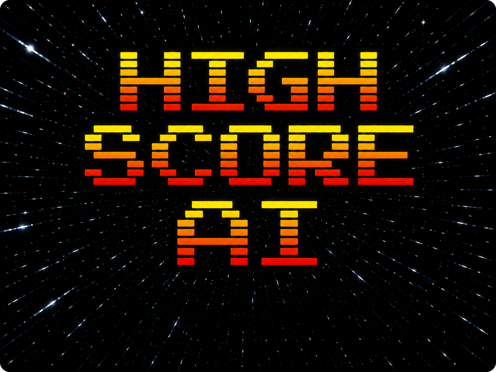
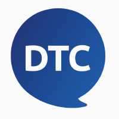

# Awesome Free Highscore AI Learning Resources

Awesome free highscore AI learning resources for artificial intelligence, machine learning, LLM applications, agents, AI coding, and related topics.

**243 resources** from official vendors, universities, established education providers, conference channels, and independent creators.

> This README is generated from [`data/resources.json`](data/resources.json).

**[Quick Submit via GitHub Issue](https://github.com/highscore-ai/awesome-free-ai-learning-courses/issues/new?template=resource-submission.md)**

## Contents

- [Official Vendors (100)](#official-vendors)
- [Established Educational Providers (135)](#established-educational-providers)
- [Major Universities (8)](#major-universities)
- [Official AI Certificates (65)](#official-ai-certificates)

---

## Official Vendors

###  NVIDIA

| Resource | Level | Duration | Release / Update | Focus |
|---|---|---|---|---|
| [Accelerated Machine Learning for Time Series Forecasting](https://learn.nvidia.com/courses/course-detail?course_id=course-v1:DLI+S-DS-10+V1) | Not specified | 2h / $30 | Not specified | Data Science |
| [Accelerating End-to-End Data Science Workflows](https://learn.nvidia.com/courses/course-detail?course_id=course-v1:DLI+S-DS-01+V2) | Not specified | 8h / $90 | Not specified | Data Science |
| [Accelerating End-to-End Data Science Workflows](https://learn.nvidia.com/courses/course-detail?course_id=course-v1:DLI+C-DS-02+V2) | Not specified | 8h / $500 | Not specified | Data Science |
| [Adding New Knowledge to LLMs](https://learn.nvidia.com/courses/course-detail?course_id=course-v1:DLI+C-FX-26+V1) | Not specified | 8h / $500 | Not specified | RAG, Embeddings & Knowledge Systems |
| [AI Infrastructure and Operations Fundamentals](https://www.nvidia.com/en-us/training/academy/course-detail?id=course%3A15139841) | Not specified | 7h / $50 | Not specified | AI Servers, GPUs & Accelerators |
| [Best Practices in Feature Engineering for Tabular Data with GPU Acceleration](https://learn.nvidia.com/courses/course-detail?course_id=course-v1:DLI+S-DS-06+V1) | Not specified | 2h / $30 | Not specified | Data Science |
| [BlueField DPU Administration](https://www.nvidia.com/en-us/training/academy/course-detail?id=course%3A15139834) | Not specified | 3h / $50 | Not specified | AI Networking & RDMA Fabrics |
| [Building Agentic AI Applications with LLMs](https://learn.nvidia.com/courses/course-detail?course_id=course-v1:DLI+S-FX-41+V1) | Not specified | 8h / $90 | Not specified | Agentic Workflows & Multi-Agent Systems |
| [Building Agentic AI Applications with LLMs](https://learn.nvidia.com/courses/course-detail?course_id=course-v1:DLI+C-FX-25+V1) | Not specified | 8h / $500 | Not specified | Agentic Workflows & Multi-Agent Systems |
| [Building AI Agents with Multimodal Models](https://learn.nvidia.com/courses/course-detail?course_id=course-v1:DLI+C-FX-17+V1) | Not specified | 8h / $90 | Not specified | Multimodal & Human-Agent Interaction |
| [Building AI Agents with Multimodal Models](https://learn.nvidia.com/courses/course-detail?course_id=course-v1:DLI+C-FX-17+V1) | Not specified | 8h / $500 | Not specified | Multimodal & Human-Agent Interaction |
| [Building Conversational AI Applications](https://www.nvidia.com/en-us/training/instructor-led-workshops/building-conversational-ai-apps/) | Not specified | 8h / $500 | Not specified | Model Architectures & Generative Models |
| [Building LLM Applications With Prompt Engineering](https://learn.nvidia.com/courses/course-detail?course_id=course-v1:DLI+S-FX-12+V2) | Not specified | 8h / $90 | Not specified | Prompting & Structured Interaction |
| [Building LLM Applications With Prompt Engineering](https://learn.nvidia.com/courses/course-detail?course_id=course-v1:DLI+C-FX-11+V1) | Not specified | 8h / $500 | Not specified | Prompting & Structured Interaction |
| [Building RAG Agents with LLMs](https://learn.nvidia.com/courses/course-detail?course_id=course-v1:DLI+S-FX-15+V1) | Intermediate | 8h / $90 | 2024-02 | RAG, Embeddings & Knowledge Systems |
| [Building RAG Agents with LLMs](https://learn.nvidia.com/courses/course-detail?course_id=course-v1:DLI+C-FX-15+V1) | Not specified | 8h / $500 | Not specified | RAG, Embeddings & Knowledge Systems |
| [Building Transformer-Based NLP Applications](https://learn.nvidia.com/courses/course-detail?course_id=course-v1:DLI+S-FX-08+V1) | Not specified | 6h / $30 | Not specified | Model Architectures & Generative Models |
| [Building Transformer-Based NLP Applications](https://learn.nvidia.com/courses/course-detail?course_id=course-v1:DLI+C-FX-03+V3) | Not specified | 8h / $500 | Not specified | Model Architectures & Generative Models |
| [Building Transformer-Based NLP Applications](https://learn.nvidia.com/courses/course-detail?course_id=course-v1:DLI+S-FX-08+V1) | Not specified | 8h / $30 | Not specified | Model Architectures & Generative Models |
| [Cumulus Linux Administration](https://www.nvidia.com/en-us/training/academy/course-detail?id=course%3A15139963) | Not specified | 5h / $100 | Not specified | AI Networking & RDMA Fabrics |
| [Cumulus Linux Administration](https://www.nvidia.com/en-us/training/academy/course-detail?id=course%3A15139963) | Not specified | 12h / $1,500 | Not specified | AI Networking & RDMA Fabrics |
| [Data Center Management Made Easy with NVIDIA UFM](https://www.nvidia.com/en-us/training/academy/course-detail?id=course%3A15139829) | Not specified | 3h / $50 | Not specified | AI Networking & RDMA Fabrics |
| [Deploying RAG Pipelines for Production at Scale](https://learn.nvidia.com/courses/course-detail?course_id=course-v1:DLI+C-FX-18+V1) | Not specified | 8h / $500 | Not specified | MLOps & Model Lifecycle Management |
| [Deploying RAG Pipelines for Production at Scale](https://learn.nvidia.com/courses/course-detail?course_id=course-v1:DLI+S-FX-19+V1) | Not specified | 4h / $90 | Not specified | MLOps & Model Lifecycle Management |
| [Enhancing Data Science Outcomes With Efficient Workflow](https://www.nvidia.com/en-us/training/instructor-led-workshops/enhancing-data-science-outcomes/) | Not specified | 8h / $500 | Not specified | Data Science |
| [Evaluating RAG and Semantic Search Systems](https://learn.nvidia.com/courses/course-detail?course_id=course-v1:DLI+S-FX-32+V1) | Not specified | 3h / $30 | Not specified | Evaluation, Reliability & Assurance |
| [Fundamentals of Accelerated Data Science](https://learn.nvidia.com/courses/course-detail?course_id=course-v1:DLI+S-DS-01+V2) | Not specified | 6h / $90 | Not specified | Data Science |
| [Fundamentals of Accelerated Data Science](https://learn.nvidia.com/courses/course-detail?course_id=course-v1:DLI+C-DS-02+V2) | Not specified | 8h / $500 | Not specified | Data Science |
| [Fundamentals of Deep Learning](https://learn.nvidia.com/courses/course-detail?course_id=course-v1:DLI+S-FX-01+V1) | Not specified | 8h / $90 | Not specified | Deep Learning |
| [Fundamentals of Deep Learning](https://learn.nvidia.com/courses/course-detail?course_id=course-v1:DLI+C-FX-01+V3) | Not specified | 8h / $500 | Not specified | Deep Learning |
| [Fundamentals of Deep Learning](https://learn.nvidia.com/courses/course-detail?course_id=course-v1:DLI+S-FX-01+V1) | Not specified | 6h / $90 | Not specified | Deep Learning |
| [Fundamentals of RDMA Programming](https://www.nvidia.com/en-us/training/academy/course-detail?id=course%3A15139820) | Not specified | 5h / $50 | Not specified | AI Networking & RDMA Fabrics |
| [Generative AI Explained](https://www.nvidia.com/en-us/training/self-paced-courses/) | Beginner | Approx. 2 hours | 2023-08 | Model Architectures & Generative Models |
| [Generative AI With Diffusion Models](https://learn.nvidia.com/courses/course-detail?course_id=course-v1:DLI+S-FX-14+V1) | Not specified | 8h / $90 | Not specified | Model Architectures & Generative Models |
| [Generative AI With Diffusion Models](https://learn.nvidia.com/courses/course-detail?course_id=course-v1:DLI+C-FX-08+V1) | Not specified | 8h / $500 | Not specified | Model Architectures & Generative Models |
| [InfiniBand Network Administration](https://www.nvidia.com/en-us/training/academy/course-detail?id=course%3A15877850) | Not specified | 6h / $200 | Not specified | AI Networking & RDMA Fabrics |
| [Introduction to Deploying RAG Pipelines for Production at Scale](https://learn.nvidia.com/courses/course-detail?course_id=course-v1:DLI+S-FX-19+V1) | Not specified | 4h / $90 | Not specified | MLOps & Model Lifecycle Management |
| [Model Parallelism: Building and Deploying Large Neural Networks](https://www.nvidia.com/en-us/training/instructor-led-workshops/model-parallelism-build-deploy-large-neural-networks) | Not specified | 8h / $500 | Not specified | Deep Learning |
| [NVIDIA AI Infrastructure: Public Training](https://www.nvidia.com/en-us/training/academy/course-detail?id=course%3A15932196) | Not specified | 25h / $3,000 | Not specified | AI Servers, GPUs & Accelerators |
| [NVIDIA AI Operations: Public Training](https://www.nvidia.com/en-us/training/academy/course-detail?id=course%3A15932192) | Not specified | 20h / $2,500 | Not specified | AI Cluster Operations, Observability & Reliability |
| [Optimizing CUDA ML Codes With NVIDIA Nsight’s Profiling Tools](https://learn.nvidia.com/courses/course-detail?course_id=course-v1:DLI+S-AC-03+V2) | Not specified | 4h / $30 | Not specified | AI Servers, GPUs & Accelerators |
| [Rapid Application Development with Large Language Models](https://learn.nvidia.com/courses/course-detail?course_id=course-v1:DLI+S-FX-26+V1) | Not specified | 8h / $90 | Not specified | AI Application Architecture & Integration |
| [Rapid Application Development with Large Language Models](https://learn.nvidia.com/courses/course-detail?course_id=course-v1:DLI+C-FX-09+V2) | Not specified | 8h / $500 | Not specified | AI Application Architecture & Integration |
| [Spectrum-X Networking Platform Administration: Private Training](https://www.nvidia.com/en-us/training/academy/course-detail?id=course%3A15877850) | Not specified | 12h / Contact Us | Not specified | AI Networking & RDMA Fabrics |

###  Anthropic

| Resource | Level | Duration | Release / Update | Focus |
|---|---|---|---|---|
| [AI Capabilities and Limitations](https://academy.claude.com/courses/ai-capabilities-and-limitations) | Beginner | Self-paced; duration not stated | 2026 | Model Architectures & Generative Models |
| [AI Fluency for Builders](https://academy.claude.com/courses/ai-fluency-for-builders) | Beginner | Self-paced; duration not stated | 2026 | Prompting & Structured Interaction |
| [AI Fluency for Educators](https://academy.claude.com/courses/ai-fluency-for-educators) | Beginner | Self-paced; duration not stated | 2025-07 | Prompting & Structured Interaction |
| [AI Fluency for Nonprofits](https://academy.claude.com/courses/ai-fluency-for-nonprofits) | Beginner | Self-paced; duration not stated | 2026 | Prompting & Structured Interaction |
| [AI Fluency for pK–12 Educators](https://academy.claude.com/courses/ai-fluency-for-k-12-educators) | Beginner | Self-paced; duration not stated | 2026 | Prompting & Structured Interaction |
| [AI Fluency for pK–12 Train the Trainer](https://academy.claude.com/courses/ai-fluency-for-pk-12-train-the-trainer) | Intermediate | Self-paced; duration not stated | 2026 | Prompting & Structured Interaction |
| [AI Fluency for Small Businesses](https://academy.claude.com/courses/ai-fluency-for-small-businesses) | Beginner | Self-paced; duration not stated | 2026 | Prompting & Structured Interaction |
| [AI Fluency for Students](https://academy.claude.com/courses/ai-fluency-for-students) | Beginner | Self-paced; duration not stated | 2025-07 | Prompting & Structured Interaction |
| [AI Fluency: Framework & Foundations](https://academy.claude.com/courses/ai-fluency-framework-foundations) | Beginner | 1.1 hours of video | 2025-07 | Everyone Uses AI |
| [Building with the Claude API](https://academy.claude.com/courses/building-with-the-claude-api) | Intermediate | 8.1 hours of video | 2024-03 | Tools, APIs & Agent Protocols |
| [Claude 101](https://academy.claude.com/courses/claude-101) | Beginner | Self-paced; duration not stated | 2024-03 | Everyone Uses AI |
| [Claude Certified Architect — Professional Prep Course](https://anthropic-partners.skilljar.com/path/claude-certified-architect-professional) | Advanced | Unknown | Unknown | AI Application Architecture & Integration |
| [Claude Certified Associate — Foundations Prep Course](https://anthropic-partners.skilljar.com/path/claude-certified-associate-foundations) | Beginner | Unknown | Unknown | AI Application Architecture & Integration |
| [Claude Certified Developer — Foundations Prep Course](https://anthropic-partners.skilljar.com/path/claude-certified-developer-foundations) | Intermediate | Unknown | Unknown | AI Application Architecture & Integration |
| [Claude Code 101](https://academy.claude.com/courses/claude-code-101) | Beginner | Self-paced; duration not stated | 2026 | AI Coding & Software Engineering |
| [Claude Code in Action](https://academy.claude.com/courses/claude-code-in-action) | Intermediate | 9 lessons; self-paced | 2025-02 | AI Coding & Software Engineering |
| [Claude Platform 101](https://academy.claude.com/courses/claude-platform-101) | Beginner | Self-paced; duration not stated | 2026 | Tools, APIs & Agent Protocols |
| [Claude with Amazon Bedrock](https://academy.claude.com/courses/claude-with-amazon-bedrock) | Intermediate | Self-paced; duration not stated | 2024 | Tools, APIs & Agent Protocols |
| [Claude with Google Cloud's Vertex AI](https://academy.claude.com/courses/claude-with-google-cloud-s-vertex-ai) | Intermediate | Self-paced; duration not stated | 2024 | Tools, APIs & Agent Protocols |
| [Introduction to Agent Skills](https://academy.claude.com/courses/introduction-to-agent-skills) | Intermediate | Self-paced; duration not stated | 2026 | Tools, APIs & Agent Protocols |
| [Introduction to Claude Cowork](https://academy.claude.com/courses/introduction-to-claude-cowork) | Beginner | Self-paced; duration not stated | 2026 | General-Purpose Work Agents |
| [Introduction to Model Context Protocol](https://academy.claude.com/courses/introduction-to-model-context-protocol) | Intermediate | Self-paced; duration not stated | 2025 | Tools, APIs & Agent Protocols |
| [Introduction to Subagents](https://academy.claude.com/courses/introduction-to-subagents) | Intermediate | Self-paced; duration not stated | 2026 | Agentic Workflows & Multi-Agent Systems |
| [Model Context Protocol: Advanced Topics](https://academy.claude.com/courses/model-context-protocol-advanced-topics) | Intermediate | Self-paced; duration not stated | 2025 | Tools, APIs & Agent Protocols |
| [Teaching AI Fluency](https://academy.claude.com/courses/teaching-ai-fluency) | Intermediate | Self-paced; duration not stated | 2025-07 | Prompting & Structured Interaction |

###  Hugging Face

| Resource | Level | Duration | Release / Update | Focus |
|---|---|---|---|---|
| [Hugging Face AI Agents Course](https://huggingface.co/learn/agents-course/unit0/introduction) | Beginner | 3–4 hours per unit | 2025 | Agentic Workflows & Multi-Agent Systems |
| [Hugging Face Audio Course](https://huggingface.co/learn/audio-course/chapter0/introduction) | Intermediate | Multi-chapter; self-paced | 2023 | Multimodal & Human-Agent Interaction |
| [Hugging Face Community Computer Vision Course](https://huggingface.co/learn/computer-vision-course/unit0/welcome/welcome) | Intermediate | 10 units; self-paced | 2024-05 | Multimodal & Human-Agent Interaction |
| [Hugging Face Context Course](https://huggingface.co/learn/context-course/unit0/introduction) | Intermediate | 6 units; 2–3 hours each | 2026 | Context, Memory & State |
| [Hugging Face Deep Reinforcement Learning Course](https://huggingface.co/learn/deep-rl-course/unit0/introduction) | Intermediate | Multi-week; self-paced | 2022; continuously updated | Machine Learning & Mathematical Foundations |
| [Hugging Face LLM Course](https://huggingface.co/learn/llm-course/chapter1/1) | Intermediate | 6–8 hours per chapter | Continuously updated | Model Architectures & Generative Models |
| [Hugging Face Model Context Protocol (MCP) Course](https://huggingface.co/learn/mcp-course/unit0/introduction) | Beginner | Multi-unit; self-paced | 2025 | Tools, APIs & Agent Protocols |

###  Microsoft

| Resource | Level | Duration | Release / Update | Focus |
|---|---|---|---|---|
| [AI Agents for Beginners](https://github.com/microsoft/ai-agents-for-beginners) | Beginner | 18 lessons; self-paced | Continuously updated | Agentic Workflows & Multi-Agent Systems |
| [AI for Beginners](https://github.com/microsoft/AI-For-Beginners) | Beginner | 12 weeks; 24 lessons | 2022; continuously updated | Machine Learning & Mathematical Foundations |
| [Generative AI for Beginners](https://github.com/microsoft/generative-ai-for-beginners) | Beginner | 21 lessons; self-paced | Version 3; continuously updated | AI Application Architecture & Integration |
| [Generative AI for Beginners .NET](https://github.com/microsoft/Generative-AI-for-beginners-dotnet) | Beginner | 5 lessons; self-paced | 2025-02 | AI Coding & Software Engineering |
| [Machine Learning for Beginners](https://github.com/microsoft/ML-For-Beginners) | Beginner | 12 weeks; 26 lessons | 2021; continuously updated | Machine Learning & Mathematical Foundations |

###  IBM

| Resource | Level | Duration | Release / Update | Focus |
|---|---|---|---|---|
| [AI Fundamentals: Foundations for Understanding AI](https://skillsbuild.org/learning-catalog?topic=ai) | Beginner | 9 hours | Current catalog | Machine Learning & Mathematical Foundations |
| [Craft Precise Prompts for AI Models](https://skillsbuild.org/learning-catalog?topic=ai) | Beginner | 4 hours | Current catalog | Prompting & Structured Interaction |
| [Make Agentic AI Work for You](https://skillsbuild.org/learning-catalog?topic=ai) | Beginner | 4 hours | Current catalog | Agentic Workflows & Multi-Agent Systems |
| [Retrieval-Augmented Generation for Enhanced AI Outputs](https://skillsbuild.org/learning-catalog?topic=ai) | Intermediate | 4 hours | Current catalog | RAG, Embeddings & Knowledge Systems |

###  LangChain

| Resource | Level | Duration | Release / Update | Focus |
|---|---|---|---|---|
| [Foundation: Introduction to Agent Observability & Evaluations](https://academy.langchain.com/courses/intro-to-langsmith) | Intermediate | 7.5 hours of video | 2025-02 | Model Evaluation & Quality |
| [Foundation: Introduction to LangGraph](https://academy.langchain.com/courses/intro-to-langgraph) | Intermediate | 6 hours of video | Continuously updated | Agentic Workflows & Multi-Agent Systems |
| [Introduction to LangChain: Build AI Agents with Python](https://academy.langchain.com/courses/foundation-introduction-to-langchain-python) | Beginner | 1.5 hours of video | 2024-10 | Agentic Workflows & Multi-Agent Systems |
| [Project: Ambient Agents with LangGraph](https://academy.langchain.com/courses/ambient-agents) | Intermediate | 2.5 hours of video | 2025-01 | Agentic Workflows & Multi-Agent Systems |

###  OpenAI

| Resource | Level | Duration | Release / Update | Focus |
|---|---|---|---|---|
| [Agents and Workflows](https://academy.openai.com/pages/courses) | Beginner | 75–90 minutes | 2026-06 | Agentic Workflows & Multi-Agent Systems |
| [AI Foundations](https://academy.openai.com/public/courses/ai-foundations-juzjs) | Beginner | 60–75 minutes | 2026-06 | Prompting & Structured Interaction |
| [Applied AI Foundations](https://academy.openai.com/public/courses/applied-ai-foundations-hgk7r) | Beginner | 75–90 minutes | 2026-06 | Prompting & Structured Interaction |
| [Spinning Up in Deep RL](https://spinningup.openai.com/en/latest/) | Intermediate | Unknown | 2018-11 | Machine Learning & Mathematical Foundations |

###  Databricks

| Resource | Level | Duration | Release / Update | Focus |
|---|---|---|---|---|
| [Generative AI Fundamentals](https://www.databricks.com/resources/learn/training/generative-ai-fundamentals) | Beginner | 1–2 hours | Updated 2026 | Model Architectures & Generative Models |
| [Large Language Models: Application through Production](https://www.youtube.com/playlist?list=PLTPXxbhUt-YWSR8wtILixhZLF9qB_1yZm) | Intermediate | Multi-week course | 2023-05 | MLOps & Model Lifecycle Management |
| [Large Language Models: Foundation Models from the Ground Up](https://www.databricks.com/blog/enroll-our-new-expert-led-large-language-models-llms-courses-edx) | Intermediate | Multi-week course | 2023-05 | Model Architectures & Generative Models |

###  AWS

| Resource | Level | Duration | Release / Update | Focus |
|---|---|---|---|---|
| [Generative AI Learning Plan for Developers](https://skillbuilder.aws/learning-plan/5C9XQBTXBB/generative-ai-learning-plan-for-developers-includes-labs/EGATKJP13J) | Intermediate | 19 hours | Continuously updated | AI Application Architecture & Integration |
| [Machine Learning Learning Plan](https://explore.skillbuilder.aws/learn/learning_plan/view/28/machine-learning-learning-plan) | Beginner | Unknown | Continuously updated | MLOps & Model Lifecycle Management |

###  Google

| Resource | Level | Duration | Release / Update | Focus |
|---|---|---|---|---|
| [Machine Learning Crash Course](https://developers.google.com/machine-learning/crash-course) | Beginner | Approx. 15 hours | Updated 2025–2026 | Machine Learning & Mathematical Foundations |
| [Managing ML Projects](https://developers.google.com/machine-learning/managing-ml-projects) | Intermediate | Unknown | 2025-08 | MLOps & Model Lifecycle Management |

[Back to top](#readme-top)

---

## Established Educational Providers

###  DeepLearning.AI

| Resource | Level | Duration | Release / Update | Focus |
|---|---|---|---|---|
| [A2A: The Agent2Agent Protocol](https://www.deeplearning.ai/courses/a2a-the-agent2agent-protocol) | Intermediate | Unknown | 2026-02 | Tools, APIs & Agent Protocols |
| [Advanced Retrieval for AI with Chroma](https://www.deeplearning.ai/courses/advanced-retrieval-for-ai-with-chroma) | Intermediate | Unknown | 2024-01 | RAG, Embeddings & Knowledge Systems |
| [Agent Memory: Building Memory-Aware Agents](https://www.deeplearning.ai/courses/agent-memory-building-memory-aware-agents) | Intermediate | Unknown | 2026-03 | Context, Memory & State |
| [Agent Skills with Anthropic](https://www.deeplearning.ai/courses/agent-skills-with-anthropic) | Intermediate | Unknown | 2026-01 | Tools, APIs & Agent Protocols |
| [Agentic AI](https://www.deeplearning.ai/courses/agentic-ai) | Intermediate | Unknown | 2025-10 | Agentic Workflows & Multi-Agent Systems |
| [Agentic Knowledge Graph Construction](https://www.deeplearning.ai/courses/agentic-knowledge-graph-construction) | Intermediate | Unknown | 2025-08 | AI Data Engineering |
| [AI Agentic Design Patterns with AutoGen](https://www.deeplearning.ai/courses/ai-agentic-design-patterns-with-autogen) | Intermediate | Unknown | 2024-05 | Agentic Workflows & Multi-Agent Systems |
| [AI Agents for Image and Video Generation](https://www.deeplearning.ai/courses/ai-agents-for-image-and-video-generation) | Intermediate | Unknown | 2026-05 | Multimodal & Human-Agent Interaction |
| [AI Agents in LangGraph](https://www.deeplearning.ai/courses/ai-agents-in-langgraph) | Intermediate | 1h42m | 2024 | Agentic Workflows & Multi-Agent Systems |
| [AI for Everyone](https://www.deeplearning.ai/courses/ai-for-everyone) | Beginner | Unknown | 2019-02 | Enterprise AI Architecture & Operating Model |
| [AI for Good](https://www.deeplearning.ai/specializations/ai-for-good) | Beginner | Unknown | 2023-04 | Responsible AI, Safety & Guardrails |
| [AI for Medicine](https://www.deeplearning.ai/specializations/ai-for-medicine) | Intermediate | Unknown | 2020-04 | Machine Learning & Mathematical Foundations |
| [AI Prompting for Everyone](https://www.deeplearning.ai/courses/ai-prompting-for-everyone) | Beginner | Unknown | 2026-05 | Prompting & Structured Interaction |
| [AI Python for Beginners](https://www.deeplearning.ai/courses/ai-python-for-beginners) | Beginner | Unknown | 2024-08 | AI Coding & Software Engineering |
| [Attention in Transformers: Concepts and Code in PyTorch](https://www.deeplearning.ai/courses/attention-in-transformers-concepts-and-code-in-pytorch) | Intermediate | Unknown | 2025-02 | Model Architectures & Generative Models |
| [Automated Testing for LLMOps](https://www.deeplearning.ai/courses/automated-testing-for-llmops) | Intermediate | Unknown | 2024-02 | MLOps & Model Lifecycle Management |
| [Build AI Apps with MCP Server: Working with Box Files](https://www.deeplearning.ai/courses/build-ai-apps-with-mcp-server-working-with-box-files) | Intermediate | Unknown | 2025-09 | Tools, APIs & Agent Protocols |
| [Build and Train an LLM with JAX](https://www.deeplearning.ai/courses/build-and-train-an-llm-with-jax) | Intermediate | Unknown | 2026-03 | Pre-Training & Distributed Training |
| [Build Apps with Windsurf’s AI Coding Agents](https://www.deeplearning.ai/courses/build-apps-with-windsurfs-ai-coding-agents) | Intermediate | Unknown | 2025-02 | AI Coding & Software Engineering |
| [Build Interactive Agents with Generative UI](https://www.deeplearning.ai/courses/build-interactive-agents-with-generative-ui) | Intermediate | Unknown | 2026-05 | Multimodal & Human-Agent Interaction |
| [Build Long-Context AI Apps with Jamba](https://www.deeplearning.ai/courses/build-long-context-ai-apps-with-jamba) | Intermediate | Unknown | 2025-01 | Context, Memory & State |
| [Build with Andrew](https://www.deeplearning.ai/courses/build-with-andrew) | Beginner | Unknown | 2026-01 | AI Application Architecture & Integration |
| [Building Agentic RAG with LlamaIndex](https://www.deeplearning.ai/courses/building-agentic-rag-with-llamaindex) | Intermediate | Unknown | 2024-05 | RAG, Embeddings & Knowledge Systems |
| [Building AI Applications With Haystack](https://www.deeplearning.ai/courses/building-ai-applications-with-haystack) | Intermediate | Unknown | 2024-09 | AI Application Architecture & Integration |
| [Building AI Browser Agents](https://www.deeplearning.ai/courses/building-ai-browser-agents) | Intermediate | Unknown | 2025-04 | Multimodal & Human-Agent Interaction |
| [Building AI Voice Agents for Production](https://www.deeplearning.ai/courses/building-ai-voice-agents-for-production) | Intermediate | Unknown | 2025-05 | Multimodal & Human-Agent Interaction |
| [Building an AI-Powered Game](https://www.deeplearning.ai/courses/building-an-ai-powered-game) | Intermediate | Unknown | 2023-11 | AI Application Architecture & Integration |
| [Building and Evaluating Advanced RAG](https://www.deeplearning.ai/courses/building-evaluating-advanced-rag) | Beginner | 2h5m | 2023-11 | RAG, Embeddings & Knowledge Systems |
| [Building and Evaluating Data Agents](https://www.deeplearning.ai/courses/building-and-evaluating-data-agents) | Intermediate | Unknown | 2025-09 | Agentic Workflows & Multi-Agent Systems |
| [Building Applications with Vector Databases](https://www.deeplearning.ai/courses/building-applications-with-vector-databases) | Intermediate | Unknown | 2024-01 | RAG, Embeddings & Knowledge Systems |
| [Building Code Agents with Hugging Face smolagents](https://www.deeplearning.ai/courses/building-code-agents-with-hugging-face-smolagents) | Intermediate | Unknown | 2025-04 | AI Coding & Software Engineering |
| [Building Coding Agents with Tool Execution](https://www.deeplearning.ai/courses/building-coding-agents-with-tool-execution) | Intermediate | Unknown | 2025-12 | AI Coding & Software Engineering |
| [Building Generative AI Applications with Gradio](https://www.deeplearning.ai/courses/building-generative-ai-applications-with-gradio) | Intermediate | Unknown | 2023-08 | AI Application Architecture & Integration |
| [Building Live Voice Agents with Google’s ADK](https://www.deeplearning.ai/courses/building-live-voice-agents-with-googles-adk) | Intermediate | Unknown | 2025-10 | Multimodal & Human-Agent Interaction |
| [Building Multimodal Data Pipelines](https://www.deeplearning.ai/courses/building-multimodal-data-pipelines) | Intermediate | Unknown | 2026-04 | AI Data Engineering |
| [Building Multimodal Search and RAG](https://www.deeplearning.ai/courses/building-multimodal-search-and-rag) | Intermediate | Under 2 hours | 2025-03 | RAG, Embeddings & Knowledge Systems |
| [Building Systems with the ChatGPT API](https://www.deeplearning.ai/courses/chatgpt-building-system) | Beginner | Approx. 1 hour | 2023-05 | AI Application Architecture & Integration |
| [Building toward Computer Use with Anthropic](https://www.deeplearning.ai/courses/building-toward-computer-use-with-anthropic) | Intermediate | Unknown | 2025-02 | Multimodal & Human-Agent Interaction |
| [Building with Llama 4](https://www.deeplearning.ai/courses/building-with-llama-4) | Intermediate | Unknown | 2025-06 | AI Application Architecture & Integration |
| [Building Your Own Database Agent](https://www.deeplearning.ai/courses/building-your-own-database-agent) | Intermediate | Unknown | 2024-06 | AI Data Engineering |
| [Carbon Aware Computing for GenAI developers](https://www.deeplearning.ai/courses/carbon-aware-computing-for-genai-developers) | Intermediate | Unknown | 2024-07 | AI Cluster Operations, Observability & Reliability |
| [ChatGPT Prompt Engineering for Developers](https://www.deeplearning.ai/courses/chatgpt-prompt-eng) | Beginner | 1h40m | 2023-04 | Prompting & Structured Interaction |
| [Claude Code: A Highly Agentic Coding Assistant](https://www.deeplearning.ai/courses/claude-code-a-highly-agentic-coding-assistant) | Intermediate | Unknown | 2025-08 | AI Coding & Software Engineering |
| [Collaborative Writing and Coding with OpenAI Canvas](https://www.deeplearning.ai/courses/collaborative-writing-and-coding-with-openai-canvas) | Beginner | Unknown | 2024-12 | Prompting & Structured Interaction |
| [Data Analytics](https://www.deeplearning.ai/courses/data-analytics) | Intermediate | Unknown | 2025-03 | AI Data Engineering |
| [Data Engineering](https://www.deeplearning.ai/specializations/data-engineering) | Intermediate | 106h59m; 4-course program | Not stated | AI Data Engineering |
| [Deep Learning Specialization](https://www.deeplearning.ai/specializations/deep-learning) | Intermediate | Unknown | 2017-08 | Deep Learning |
| [Design, Develop, and Deploy Multi-Agent Systems with CrewAI](https://www.deeplearning.ai/courses/design-develop-and-deploy-multi-agent-systems-with-crewai) | Intermediate | Unknown | 2025-11 | Agentic Workflows & Multi-Agent Systems |
| [Document AI: From OCR to Agentic Doc Extraction](https://www.deeplearning.ai/courses/document-ai-from-ocr-to-agentic-doc-extraction) | Intermediate | Unknown | 2026-01 | AI Data Engineering |
| [DSPy: Build and Optimize Agentic Apps](https://www.deeplearning.ai/courses/dspy-build-and-optimize-agentic-apps) | Intermediate | Unknown | 2025-06 | Agentic Workflows & Multi-Agent Systems |
| [Efficient Inference with SGLang: Text and Image Generation](https://www.deeplearning.ai/courses/efficient-inference-with-sglang-text-and-image-generation) | Intermediate | Unknown | 2026-04 | Model Serving & Inference Optimization |
| [Efficiently Serving LLMs](https://www.deeplearning.ai/courses/efficiently-serving-llms) | Intermediate | Unknown | 2024-04 | Model Serving & Inference Optimization |
| [Embedding Models: from Architecture to Implementation](https://www.deeplearning.ai/courses/embedding-models-from-architecture-to-implementation) | Intermediate | Unknown | 2024-08 | RAG, Embeddings & Knowledge Systems |
| [Evaluating AI Agents](https://www.deeplearning.ai/courses/evaluating-ai-agents) | Beginner | 2h36m | 2025-02 | Model Evaluation & Quality |
| [Evaluating and Debugging Generative AI](https://www.deeplearning.ai/courses/evaluating-and-debugging-generative-ai) | Intermediate | Unknown | 2023-08 | Model Evaluation & Quality |
| [Event-Driven Agentic Document Workflows](https://www.deeplearning.ai/courses/event-driven-agentic-document-workflows) | Intermediate | Unknown | 2025-03 | AI Application Architecture & Integration |
| [Fast & Efficient LLM Inference with vLLM](https://www.deeplearning.ai/courses/fast-and-efficient-llm-inference-with-vllm) | Intermediate | Unknown | 2026-06 | Model Serving & Inference Optimization |
| [Fast Prototyping of GenAI Apps with Streamlit](https://www.deeplearning.ai/courses/fast-prototyping-of-genai-apps-with-streamlit) | Intermediate | Unknown | 2025-08 | AI Application Architecture & Integration |
| [Federated Fine-tuning of LLMs with Private Data](https://www.deeplearning.ai/courses/federated-fine-tuning-of-llms-with-private-data) | Intermediate | Unknown | 2024-07 | Fine-Tuning, Alignment & Post-Training |
| [Fine-tuning & RL for LLMs: Intro to Post-training](https://www.deeplearning.ai/courses/fine-tuning-and-rl-for-llms-intro-to-post-training) | Intermediate | Unknown | 2026-06 | Fine-Tuning, Alignment & Post-Training |
| [Finetuning Large Language Models](https://www.deeplearning.ai/courses/finetuning-large-language-models) | Intermediate | Unknown | 2023-08 | Fine-Tuning, Alignment & Post-Training |
| [Function-calling and data extraction with LLMs](https://www.deeplearning.ai/courses/function-calling-and-data-extraction-with-llms) | Intermediate | Unknown | 2024-06 | Tools, APIs & Agent Protocols |
| [Functions, Tools and Agents with LangChain](https://www.deeplearning.ai/courses/functions-tools-and-agents-with-langchain) | Intermediate | Unknown | 2023-10 | Tools, APIs & Agent Protocols |
| [Gemini CLI: Code & Create with an Open-Source Agent](https://www.deeplearning.ai/courses/gemini-cli-code-and-create-with-an-open-source-agent) | Intermediate | Unknown | 2026-02 | AI Coding & Software Engineering |
| [Generative AI for Everyone](https://www.deeplearning.ai/courses/generative-ai-for-everyone) | Beginner | Unknown | 2023-11 | Model Architectures & Generative Models |
| [Generative AI for Software Development](https://www.deeplearning.ai/courses/generative-ai-for-software-development) | Intermediate | Unknown | 2024-08 | AI Coding & Software Engineering |
| [Generative AI with Large Language Models](https://www.deeplearning.ai/courses/generative-ai-with-large-language-models) | Intermediate | Unknown | 2023-06 | Model Architectures & Generative Models |
| [Getting Started with Mistral](https://www.deeplearning.ai/courses/getting-started-with-mistral) | Beginner | Unknown | 2024-04 | AI Application Architecture & Integration |
| [Getting Structured LLM Output](https://www.deeplearning.ai/courses/getting-structured-llm-output) | Intermediate | Unknown | 2025-04 | Prompting & Structured Interaction |
| [Governing AI Agents](https://www.deeplearning.ai/courses/governing-ai-agents) | Intermediate | Unknown | 2025-10 | Compliance, Risk & Audit |
| [How Business Thinkers Can Start Building AI Plugins With Semantic Kernel](https://www.deeplearning.ai/courses/how-business-thinkers-can-start-building-ai-plugins-with-semantic-kernel) | Beginner | Unknown | 2023-09 | AI Application Architecture & Integration |
| [How Diffusion Models Work](https://www.deeplearning.ai/courses/diffusion-models) | Intermediate | Unknown | 2023-06 | Model Architectures & Generative Models |
| [How Transformer LLMs Work](https://www.deeplearning.ai/courses/how-transformer-llms-work) | Beginner | Unknown | 2025-02 | Model Architectures & Generative Models |
| [Improving Accuracy of LLM Applications](https://www.deeplearning.ai/courses/improving-accuracy-of-llm-applications) | Intermediate | Unknown | 2024-08 | Model Evaluation & Quality |
| [Intro to Federated Learning](https://www.deeplearning.ai/courses/intro-to-federated-learning) | Intermediate | Unknown | 2024-07 | Pre-Training & Distributed Training |
| [Introducing Multimodal Llama 3.2](https://www.deeplearning.ai/courses/introducing-multimodal-llama-3-2) | Beginner | Unknown | 2024-10 | Multimodal & Human-Agent Interaction |
| [Introduction to on-device AI](https://www.deeplearning.ai/courses/introduction-to-on-device-ai) | Beginner | Unknown | 2024-05 | AI Servers, GPUs & Accelerators |
| [JavaScript RAG Web Apps with LlamaIndex](https://www.deeplearning.ai/courses/javascript-rag-web-apps-with-llamaindex) | Intermediate | Unknown | 2024-04 | RAG, Embeddings & Knowledge Systems |
| [Jupyter AI: AI Coding in Notebooks](https://www.deeplearning.ai/courses/jupyter-ai-ai-coding-in-notebooks) | Intermediate | Unknown | 2025-11 | AI Coding & Software Engineering |
| [Knowledge Graphs for AI Agent API Discovery](https://www.deeplearning.ai/courses/knowledge-graphs-for-ai-agent-api-discovery) | Intermediate | Unknown | 2025-09 | Tools, APIs & Agent Protocols |
| [Knowledge Graphs for RAG](https://www.deeplearning.ai/courses/knowledge-graphs-for-rag) | Intermediate | Unknown | 2024-03 | RAG, Embeddings & Knowledge Systems |
| [LangChain Chat with Your Data](https://www.deeplearning.ai/courses/langchain-chat-with-your-data) | Intermediate | Unknown | 2023-07 | RAG, Embeddings & Knowledge Systems |
| [LangChain for LLM Application Development](https://www.deeplearning.ai/courses/langchain-for-llm-application-development) | Intermediate | Unknown | 2023-05 | AI Application Architecture & Integration |
| [Large Language Models with Semantic Search](https://www.deeplearning.ai/courses/large-language-models-with-semantic-search) | Intermediate | Unknown | 2023-08 | RAG, Embeddings & Knowledge Systems |
| [Large Multimodal Model Prompting with Gemini](https://www.deeplearning.ai/courses/large-multimodal-model-prompting-with-gemini) | Beginner | Unknown | 2024-08 | Prompting & Structured Interaction |
| [LLMOps](https://www.deeplearning.ai/courses/llmops) | Intermediate | Unknown | 2024-01 | MLOps & Model Lifecycle Management |
| [LLMs as Operating Systems: Agent Memory](https://www.deeplearning.ai/courses/llms-as-operating-systems-agent-memory) | Intermediate | Unknown | 2024-10 | Context, Memory & State |
| [Long-Term Agentic Memory With LangGraph](https://www.deeplearning.ai/courses/long-term-agentic-memory-with-langgraph) | Intermediate | Unknown | 2025-03 | Context, Memory & State |
| [Machine Learning in Production](https://www.deeplearning.ai/courses/machine-learning-in-production) | Intermediate | Unknown | 2021-06 | MLOps & Model Lifecycle Management |
| [Machine Learning Specialization](https://www.deeplearning.ai/specializations/machine-learning) | Beginner | Unknown | 2022-07 | Machine Learning & Mathematical Foundations |
| [Mathematics for Machine Learning and Data Science](https://www.deeplearning.ai/specializations/mathematics-for-machine-learning-and-data-science) | Intermediate | Unknown | 2023-01 | Machine Learning & Mathematical Foundations |
| [MCP: Build Rich-Context AI Apps with Anthropic](https://www.deeplearning.ai/courses/mcp-build-rich-context-ai-apps-with-anthropic) | Intermediate | Unknown | 2025-05 | Tools, APIs & Agent Protocols |
| [Multi AI Agent Systems with crewAI](https://www.deeplearning.ai/courses/multi-ai-agent-systems-with-crewai) | Beginner | 3h1m | 2024 | Agentic Workflows & Multi-Agent Systems |
| [Multi-vector Image Retrieval](https://www.deeplearning.ai/courses/multi-vector-image-retrieval) | Intermediate | Unknown | 2025-12 | RAG, Embeddings & Knowledge Systems |
| [Natural Language Processing Specialization](https://www.deeplearning.ai/specializations/natural-language-processing) | Intermediate | Unknown | 2020-06 | Deep Learning |
| [Nvidia’s NeMo Agent Toolkit: Making Agents Reliable](https://www.deeplearning.ai/courses/nvidia-nat-making-agents-reliable) | Intermediate | Unknown | 2025-12 | Evaluation, Reliability & Assurance |
| [Open Source Models with Hugging Face](https://www.deeplearning.ai/courses/open-source-models-with-hugging-face) | Intermediate | Unknown | 2024-03 | AI Application Architecture & Integration |
| [Orchestrating Workflows for GenAI Applications](https://www.deeplearning.ai/courses/orchestrating-workflows-for-genai-applications) | Intermediate | Unknown | 2025-06 | MLOps & Model Lifecycle Management |
| [Pair Programming with a Large Language Model](https://www.deeplearning.ai/courses/pair-programming-with-a-large-language-model) | Beginner | Unknown | 2023-09 | AI Coding & Software Engineering |
| [Post-training of LLMs](https://www.deeplearning.ai/courses/post-training-of-llms) | Intermediate | Unknown | 2025-07 | Fine-Tuning, Alignment & Post-Training |
| [Practical Multi AI Agents and Advanced Use Cases with crewAI](https://www.deeplearning.ai/courses/practical-multi-ai-agents-and-advanced-use-cases-with-crewai) | Intermediate | Unknown | 2025-01 | Agentic Workflows & Multi-Agent Systems |
| [Preprocessing Unstructured Data for LLM Applications](https://www.deeplearning.ai/courses/preprocessing-unstructured-data-for-llm-applications) | Intermediate | Unknown | 2024-04 | AI Data Engineering |
| [Pretraining LLMs](https://www.deeplearning.ai/courses/pretraining-llms) | Intermediate | Unknown | 2024-07 | Pre-Training & Distributed Training |
| [Prompt Compression and Query Optimization](https://www.deeplearning.ai/courses/prompt-compression-and-query-optimization) | Intermediate | Unknown | 2024-07 | Context, Memory & State |
| [Prompt Engineering for Vision Models](https://www.deeplearning.ai/courses/prompt-engineering-for-vision-models) | Beginner | Unknown | 2024-05 | Prompting & Structured Interaction |
| [Prompt Engineering with Llama 2&3](https://www.deeplearning.ai/courses/prompt-engineering-with-llama-2) | Beginner | Unknown | 2024-03 | Prompting & Structured Interaction |
| [Pydantic for LLM Workflows](https://www.deeplearning.ai/courses/pydantic-for-llm-workflows) | Intermediate | Unknown | 2025-07 | AI Application Architecture & Integration |
| [PyTorch for Deep Learning](https://www.deeplearning.ai/specializations/pytorch-for-deep-learning-professional-certificate) | Intermediate | Unknown | 2025-10 | Deep Learning |
| [Quantization Fundamentals with Hugging Face](https://www.deeplearning.ai/courses/quantization-fundamentals-with-hugging-face) | Intermediate | Unknown | 2024-04 | Model Serving & Inference Optimization |
| [Quantization in Depth](https://www.deeplearning.ai/courses/quantization-in-depth) | Intermediate | Unknown | 2024-05 | Model Serving & Inference Optimization |
| [Reasoning with o1](https://www.deeplearning.ai/courses/reasoning-with-o1) | Beginner | Unknown | 2024-12 | Prompting & Structured Interaction |
| [Red Teaming LLM Applications](https://www.deeplearning.ai/courses/red-teaming-llm-applications) | Intermediate | Unknown | 2024-04 | AI, Agent & Model Security |
| [Reinforcement Fine-Tuning LLMs With GRPO](https://www.deeplearning.ai/courses/reinforcement-fine-tuning-llms-with-grpo) | Intermediate | Unknown | 2025-05 | Fine-Tuning, Alignment & Post-Training |
| [Reinforcement Learning From Human Feedback](https://www.deeplearning.ai/courses/reinforcement-learning-from-human-feedback) | Intermediate | Unknown | 2023-12 | Fine-Tuning, Alignment & Post-Training |
| [Retrieval Augmented Generation (RAG)](https://www.deeplearning.ai/courses/retrieval-augmented-generation-rag) | Intermediate | Unknown | 2025-07 | RAG, Embeddings & Knowledge Systems |
| [Retrieval Optimization: Tokenization to Vector Quantization](https://www.deeplearning.ai/courses/retrieval-optimization-tokenization-to-vector-quantization) | Intermediate | Unknown | 2024-12 | RAG, Embeddings & Knowledge Systems |
| [Safe and reliable AI via guardrails](https://www.deeplearning.ai/courses/safe-and-reliable-ai-via-guardrails) | Intermediate | Unknown | 2023-11 | Responsible AI, Safety & Guardrails |
| [Semantic Caching for AI Agents](https://www.deeplearning.ai/courses/semantic-caching-for-ai-agents) | Intermediate | Unknown | 2025-11 | AI Application Architecture & Integration |
| [Spec-Driven Development with Coding Agents](https://www.deeplearning.ai/courses/spec-driven-development-with-coding-agents) | Intermediate | Unknown | 2026-04 | AI Coding & Software Engineering |
| [TensorFlow Developer Professional Certificate](https://www.deeplearning.ai/specializations/tensorflow-developer-professional-certificate) | Intermediate | Unknown | 2019-11 | Deep Learning |
| [Transformers in Practice](https://www.deeplearning.ai/courses/transformers-in-practice) | Intermediate | Unknown | 2026-05 | Model Architectures & Generative Models |
| [Understanding and Applying Text Embeddings](https://www.deeplearning.ai/courses/understanding-and-applying-text-embeddings) | Intermediate | Unknown | 2023-09 | RAG, Embeddings & Knowledge Systems |
| [Vector Databases: from Embeddings to Applications](https://www.deeplearning.ai/courses/vector-databases-from-embeddings-to-applications) | Intermediate | Unknown | 2023-11 | RAG, Embeddings & Knowledge Systems |
| [Vibe Coding 101 with Replit](https://www.deeplearning.ai/courses/vibe-coding-101-with-replit) | Beginner | Unknown | 2025-03 | AI Coding & Software Engineering |

###  Kaggle

| Resource | Level | Duration | Release / Update | Focus |
|---|---|---|---|---|
| [5-Day AI Agents: Intensive Vibe Coding Course With Google](https://www.kaggle.com/learn-guide/5-day-agents-vibecoding) | Intermediate | 5 days; self-paced | 2026-06 | Agentic Workflows & Multi-Agent Systems |
| [5-Day Gen AI Intensive Course with Google](https://www.kaggle.com/learn-guide/5-day-genai) | Intermediate | 5 days; self-paced | 2025-03 | Model Architectures & Generative Models |
| [Computer Vision](https://www.kaggle.com/learn/computer-vision) | Intermediate | 4 hours | 2019-11 | Multimodal & Human-Agent Interaction |
| [Intermediate Machine Learning](https://www.kaggle.com/learn/intermediate-machine-learning) | Intermediate | 4 hours | 2019-01 | Machine Learning & Mathematical Foundations |
| [Intro to AI Ethics](https://www.kaggle.com/learn/intro-to-ai-ethics) | Beginner | 4 hours | 2020-03 | Responsible AI, Safety & Guardrails |
| [Intro to Deep Learning](https://www.kaggle.com/learn/intro-to-deep-learning) | Beginner | Approx. 4 hours | 2019-09 | Deep Learning |
| [Intro to Machine Learning](https://www.kaggle.com/learn/intro-to-machine-learning) | Beginner | Approx. 3 hours | 2018-03 | Machine Learning & Mathematical Foundations |

###  DataTalks.Club

| Resource | Level | Duration | Release / Update | Focus |
|---|---|---|---|---|
| [AI Dev Tools Zoomcamp](https://www.youtube.com/playlist?list=PL3MmuxUbc_hLuyafXPyhTdbF4s_uNhc43) | Intermediate | 6 modules plus final project; self-paced | 2026-08 | AI Coding & Software Engineering |
| [Machine Learning Zoomcamp](https://www.youtube.com/playlist?list=PL3MmuxUbc_hIhxl5Ji8t4O6lPAOpHaCLR) | Intermediate | 19 weeks; self-paced option available | 2026-09 | Machine Learning & Mathematical Foundations |

###  fast.ai

| Resource | Level | Duration | Release / Update | Focus |
|---|---|---|---|---|
| [Practical Deep Learning for Coders](https://course.fast.ai/) | Intermediate | 9 lessons; about 13.5 hours | 2022 | Deep Learning |

###  Full Stack Deep Learning

| Resource | Level | Duration | Release / Update | Focus |
|---|---|---|---|---|
| [Full Stack Deep Learning — 2022 Course](https://fullstackdeeplearning.com/course/2022/) | Intermediate | 10 weeks; about 4 hours per week | 2022-10 | MLOps & Model Lifecycle Management |

[Back to top](#readme-top)

---

## Major Universities

###  Stanford University

| Resource | Level | Duration | Release / Update | Focus |
|---|---|---|---|---|
| [Stanford CS224N: Natural Language Processing with Deep Learning](https://web.stanford.edu/class/cs224n/) | Intermediate | 10-week university course | 2026 course materials; 2024 full videos | Deep Learning |
| [Stanford CS229: Machine Learning](https://cs229.stanford.edu/) | Intermediate | 10-week university course | Continuously updated | Machine Learning & Mathematical Foundations |
| [Stanford CS230: Deep Learning](https://cs230.stanford.edu/) | Intermediate | 10 weeks; public materials vary by offering | 2025-12 | Deep Learning |
| [Stanford CS231n: Deep Learning for Computer Vision](https://cs231n.stanford.edu/2025/) | Intermediate | 10 weeks | 2025-04 | Multimodal & Human-Agent Interaction |
| [Stanford CS25: Transformers United](https://web.stanford.edu/class/cs25/) | Intermediate | Weekly seminar series | Version 6; continuously updated | Model Architectures & Generative Models |
| [Stanford CS336: Language Modeling from Scratch](https://stanford-cs336.github.io/) | Intermediate | 10-week university course | Spring 2026 | Pre-Training & Distributed Training |

###  Harvard University

| Resource | Level | Duration | Release / Update | Focus |
|---|---|---|---|---|
| [CS50's Introduction to Artificial Intelligence with Python](https://cs50.harvard.edu/ai/) | Intermediate | 7 weeks | 2024 edition | Machine Learning & Mathematical Foundations |

###  MIT

| Resource | Level | Duration | Release / Update | Focus |
|---|---|---|---|---|
| [MIT 6.S191: Introduction to Deep Learning](https://introtodeeplearning.com/) | Intermediate | 9-week 2026 edition | 2026-03 | Deep Learning |

[Back to top](#readme-top)

---

## Official AI Certificates

These are official credentials from their issuers. The linked preparation courses are free learning resources; certification exams, registrations, and credentials may have separate fees or requirements.

**65 certificates**; **42** have mapped free preparation courses.

| Certificate | Issuer / Credential | Mapped free preparation courses |
|---|---|---|
| [Claude Certified Architect — Foundations](https://anthropic-partners.skilljar.com/claude-certified-architect-foundations-certification) | Anthropic · Professional Certification | [AI Fluency: Framework & Foundations](https://academy.claude.com/courses/ai-fluency-framework-foundations); [Building with the Claude API](https://academy.claude.com/courses/building-with-the-claude-api); [Claude 101](https://academy.claude.com/courses/claude-101); [Claude Code in Action](https://academy.claude.com/courses/claude-code-in-action); [Claude with Amazon Bedrock](https://academy.claude.com/courses/claude-with-amazon-bedrock); [Claude with Google Cloud's Vertex AI](https://academy.claude.com/courses/claude-with-google-cloud-s-vertex-ai); [Introduction to Model Context Protocol](https://academy.claude.com/courses/introduction-to-model-context-protocol) |
| [Claude Certified Architect — Professional](https://anthropic-partners.skilljar.com/claude-certified-architect-professional-certification) | Anthropic · Professional Certification | [Building with the Claude API](https://academy.claude.com/courses/building-with-the-claude-api); [Claude Certified Architect — Professional Prep Course](https://anthropic-partners.skilljar.com/path/claude-certified-architect-professional); [Claude with Amazon Bedrock](https://academy.claude.com/courses/claude-with-amazon-bedrock); [Claude with Google Cloud's Vertex AI](https://academy.claude.com/courses/claude-with-google-cloud-s-vertex-ai); [Introduction to Model Context Protocol](https://academy.claude.com/courses/introduction-to-model-context-protocol); [Model Context Protocol: Advanced Topics](https://academy.claude.com/courses/model-context-protocol-advanced-topics) |
| [Claude Certified Associate — Foundations](https://anthropic-partners.skilljar.com/claude-certified-associate-foundations-certification) | Anthropic · Professional Certification | [AI Fluency: Framework & Foundations](https://academy.claude.com/courses/ai-fluency-framework-foundations); [Claude 101](https://academy.claude.com/courses/claude-101); [Claude Certified Associate — Foundations Prep Course](https://anthropic-partners.skilljar.com/path/claude-certified-associate-foundations); [Introduction to Claude Cowork](https://academy.claude.com/courses/introduction-to-claude-cowork) |
| [Claude Certified Developer — Foundations](https://anthropic-partners.skilljar.com/claude-certified-developer-foundations-certification) | Anthropic · Professional Certification | [Building with the Claude API](https://academy.claude.com/courses/building-with-the-claude-api); [Claude Certified Developer — Foundations Prep Course](https://anthropic-partners.skilljar.com/path/claude-certified-developer-foundations); [Claude Code in Action](https://academy.claude.com/courses/claude-code-in-action); [Introduction to Model Context Protocol](https://academy.claude.com/courses/introduction-to-model-context-protocol) |
| [AWS Certified AI Business Strategist (beta)](https://aws.amazon.com/certification/certified-ai-business-strategist/) | AWS · Professional Certification | No mapped free preparation course yet. |
| [AWS Certified AI Practitioner](https://aws.amazon.com/certification/certified-ai-practitioner/) | AWS · Professional Certification | No mapped free preparation course yet. |
| [AWS Certified Generative AI Developer – Professional](https://aws.amazon.com/certification/certified-generative-ai-developer-professional/) | AWS · Professional Certification | No mapped free preparation course yet. |
| [AWS Certified Machine Learning Engineer – Associate](https://aws.amazon.com/certification/certified-machine-learning-engineer-associate/) | AWS · Professional Certification | No mapped free preparation course yet. |
| [Agentic AI](https://www.deeplearning.ai/courses/agentic-ai) | DeepLearning.AI · Course Certificate | [Agentic AI](https://www.deeplearning.ai/courses/agentic-ai) |
| [AI for Everyone](https://www.deeplearning.ai/courses/ai-for-everyone) | DeepLearning.AI · Course Certificate | [AI for Everyone](https://www.deeplearning.ai/courses/ai-for-everyone) |
| [AI for Good](https://www.deeplearning.ai/specializations/ai-for-good) | DeepLearning.AI · Professional Certificate | [AI for Good](https://www.deeplearning.ai/specializations/ai-for-good) |
| [AI for Medicine](https://www.deeplearning.ai/specializations/ai-for-medicine) | DeepLearning.AI · Professional Certificate | [AI for Medicine](https://www.deeplearning.ai/specializations/ai-for-medicine) |
| [AI Prompting for Everyone](https://www.deeplearning.ai/courses/ai-prompting-for-everyone) | DeepLearning.AI · Course Certificate | [AI Prompting for Everyone](https://www.deeplearning.ai/courses/ai-prompting-for-everyone) |
| [AI Python for Beginners](https://www.deeplearning.ai/courses/ai-python-for-beginners) | DeepLearning.AI · Course Certificate | [AI Python for Beginners](https://www.deeplearning.ai/courses/ai-python-for-beginners) |
| [Build with Andrew](https://www.deeplearning.ai/courses/build-with-andrew) | DeepLearning.AI · Course Certificate | [Build with Andrew](https://www.deeplearning.ai/courses/build-with-andrew) |
| [Data Analytics](https://www.deeplearning.ai/specializations/data-analytics) | DeepLearning.AI · Professional Certificate | [Data Analytics](https://www.deeplearning.ai/courses/data-analytics) |
| [Data Engineering](https://www.deeplearning.ai/specializations/data-engineering) | DeepLearning.AI · Professional Certificate | [Data Engineering](https://www.deeplearning.ai/specializations/data-engineering) |
| [Deep Learning Specialization](https://www.deeplearning.ai/specializations/deep-learning) | DeepLearning.AI · Professional Certificate | [Deep Learning Specialization](https://www.deeplearning.ai/specializations/deep-learning) |
| [Design, Develop, and Deploy Multi-Agent Systems with CrewAI](https://www.deeplearning.ai/courses/design-develop-and-deploy-multi-agent-systems-with-crewai) | DeepLearning.AI · Course Certificate | [Design, Develop, and Deploy Multi-Agent Systems with CrewAI](https://www.deeplearning.ai/courses/design-develop-and-deploy-multi-agent-systems-with-crewai) |
| [Fast Prototyping of GenAI Apps with Streamlit](https://www.deeplearning.ai/courses/fast-prototyping-of-genai-apps-with-streamlit) | DeepLearning.AI · Course Certificate | [Fast Prototyping of GenAI Apps with Streamlit](https://www.deeplearning.ai/courses/fast-prototyping-of-genai-apps-with-streamlit) |
| [Fine-tuning & RL for LLMs: Intro to Post-training](https://www.deeplearning.ai/courses/fine-tuning-and-rl-for-llms-intro-to-post-training) | DeepLearning.AI · Course Certificate | [Fine-tuning & RL for LLMs: Intro to Post-training](https://www.deeplearning.ai/courses/fine-tuning-and-rl-for-llms-intro-to-post-training) |
| [Generative AI for Everyone](https://www.deeplearning.ai/courses/generative-ai-for-everyone) | DeepLearning.AI · Course Certificate | [Generative AI for Everyone](https://www.deeplearning.ai/courses/generative-ai-for-everyone) |
| [Generative AI for Software Development](https://www.deeplearning.ai/specializations/generative-ai-for-software-development) | DeepLearning.AI · Professional Certificate | [Generative AI for Software Development](https://www.deeplearning.ai/courses/generative-ai-for-software-development) |
| [Generative AI with Large Language Models](https://www.deeplearning.ai/courses/generative-ai-with-large-language-models) | DeepLearning.AI · Course Certificate | [Generative AI with Large Language Models](https://www.deeplearning.ai/courses/generative-ai-with-large-language-models) |
| [Machine Learning in Production](https://www.deeplearning.ai/courses/machine-learning-in-production) | DeepLearning.AI · Course Certificate | [Machine Learning in Production](https://www.deeplearning.ai/courses/machine-learning-in-production) |
| [Machine Learning Specialization](https://www.deeplearning.ai/specializations/machine-learning) | DeepLearning.AI · Professional Certificate | [Machine Learning Specialization](https://www.deeplearning.ai/specializations/machine-learning) |
| [Mathematics for Machine Learning and Data Science](https://www.deeplearning.ai/specializations/mathematics-for-machine-learning-and-data-science) | DeepLearning.AI · Professional Certificate | [Mathematics for Machine Learning and Data Science](https://www.deeplearning.ai/specializations/mathematics-for-machine-learning-and-data-science) |
| [Natural Language Processing Specialization](https://www.deeplearning.ai/specializations/natural-language-processing) | DeepLearning.AI · Professional Certificate | [Natural Language Processing Specialization](https://www.deeplearning.ai/specializations/natural-language-processing) |
| [PyTorch for Deep Learning](https://www.deeplearning.ai/specializations/pytorch-for-deep-learning-professional-certificate) | DeepLearning.AI · Professional Certificate | [PyTorch for Deep Learning](https://www.deeplearning.ai/specializations/pytorch-for-deep-learning-professional-certificate) |
| [Retrieval Augmented Generation (RAG)](https://www.deeplearning.ai/courses/retrieval-augmented-generation-rag) | DeepLearning.AI · Course Certificate | [Retrieval Augmented Generation (RAG)](https://www.deeplearning.ai/courses/retrieval-augmented-generation-rag) |
| [TensorFlow Developer Professional Certificate](https://www.deeplearning.ai/specializations/tensorflow-developer-professional-certificate) | DeepLearning.AI · Professional Certificate | [TensorFlow Developer Professional Certificate](https://www.deeplearning.ai/specializations/tensorflow-developer-professional-certificate) |
| [Transformers in Practice](https://www.deeplearning.ai/courses/transformers-in-practice) | DeepLearning.AI · Course Certificate | [Transformers in Practice](https://www.deeplearning.ai/courses/transformers-in-practice) |
| [Generative AI Leader](https://cloud.google.com/learn/certification/generative-ai-leader) | Google Cloud · Professional Certification | No mapped free preparation course yet. |
| [Professional Agentic Architect](https://cloud.google.com/learn/certification/agentic-architect) | Google Cloud · Professional Certification | No mapped free preparation course yet. |
| [Professional Machine Learning Engineer](https://cloud.google.com/learn/certification/machine-learning-engineer) | Google Cloud · Professional Certification | No mapped free preparation course yet. |
| [CS50's Introduction to Artificial Intelligence with Python](https://cs50.harvard.edu/ai/) | Harvard University · Free Completion Certificate | [CS50's Introduction to Artificial Intelligence with Python](https://cs50.harvard.edu/ai/) |
| [Agentic AI Business Solutions Architect](https://learn.microsoft.com/en-us/credentials/certifications/agentic-ai-business-solutions-architect/) | Microsoft · Professional Certification | No mapped free preparation course yet. |
| [AI Agent Builder Associate](https://learn.microsoft.com/en-us/credentials/certifications/ai-agent-builder-associate/) | Microsoft · Professional Certification | No mapped free preparation course yet. |
| [AI Business Professional](https://learn.microsoft.com/en-us/credentials/certifications/ai-business-professional/) | Microsoft · Professional Certification | No mapped free preparation course yet. |
| [AI Services Administrator Associate (beta)](https://learn.microsoft.com/en-us/credentials/certifications/ai-services-administrator-associate/) | Microsoft · Professional Certification | No mapped free preparation course yet. |
| [AI Transformation Leader](https://learn.microsoft.com/en-us/credentials/certifications/ai-transformation-leader/) | Microsoft · Professional Certification | No mapped free preparation course yet. |
| [Azure AI Apps and Agents Developer Associate](https://learn.microsoft.com/en-us/credentials/certifications/azure-ai-apps-and-agents-developer-associate/) | Microsoft · Professional Certification | No mapped free preparation course yet. |
| [Azure AI Cloud Developer Associate](https://learn.microsoft.com/en-us/credentials/certifications/azure-ai-cloud-developer-associate/) | Microsoft · Professional Certification | No mapped free preparation course yet. |
| [Azure AI Fundamentals](https://learn.microsoft.com/en-us/credentials/certifications/azure-ai-fundamentals/) | Microsoft · Professional Certification | No mapped free preparation course yet. |
| [Copilot and Agent Administration Fundamentals](https://learn.microsoft.com/en-us/credentials/certifications/copilot-and-agent-administration-fundamentals/) | Microsoft · Professional Certification | No mapped free preparation course yet. |
| [Dynamics 365 Contact Center AI Engineer Associate](https://learn.microsoft.com/en-us/credentials/certifications/d365-contact-center-ai-engineer-associate/) | Microsoft · Professional Certification | No mapped free preparation course yet. |
| [Dynamics 365 Sales AI Consultant Associate](https://learn.microsoft.com/en-us/credentials/certifications/dynamics-365-sales-ai-consultant-associate/) | Microsoft · Professional Certification | No mapped free preparation course yet. |
| [Intelligent Applications Builder Associate](https://learn.microsoft.com/en-us/credentials/certifications/intelligent-applications-builder-associate/) | Microsoft · Professional Certification | No mapped free preparation course yet. |
| [Machine Learning Operations Engineer Associate](https://learn.microsoft.com/en-us/credentials/certifications/operationalizing-machine-learning-and-generative-ai-solutions/) | Microsoft · Professional Certification | No mapped free preparation course yet. |
| [Multi-Agent AI Solutions Expert (beta)](https://learn.microsoft.com/en-us/credentials/certifications/multi-agent-ai-solutions-expert/) | Microsoft · Professional Certification | No mapped free preparation course yet. |
| [SQL AI Developer Associate](https://learn.microsoft.com/en-us/credentials/certifications/developing-ai-enabled-database-solutions/) | Microsoft · Professional Certification | No mapped free preparation course yet. |
| [NCA Accelerated Data Science](https://www.nvidia.com/en-us/learn/certification/accelerated-data-science-associate/) | NVIDIA · Professional Certification | [Accelerated Machine Learning for Time Series Forecasting](https://learn.nvidia.com/courses/course-detail?course_id=course-v1:DLI+S-DS-10+V1); [Accelerating End-to-End Data Science Workflows](https://learn.nvidia.com/courses/course-detail?course_id=course-v1:DLI+S-DS-01+V2); [Accelerating End-to-End Data Science Workflows](https://learn.nvidia.com/courses/course-detail?course_id=course-v1:DLI+C-DS-02+V2); [Best Practices in Feature Engineering for Tabular Data with GPU Acceleration](https://learn.nvidia.com/courses/course-detail?course_id=course-v1:DLI+S-DS-06+V1) |
| [NCA AI Infrastructure and Operations](https://www.nvidia.com/en-us/learn/certification/ai-infrastructure-operations-associate/) | NVIDIA · Professional Certification | [AI Infrastructure and Operations Fundamentals](https://www.nvidia.com/en-us/training/academy/course-detail?id=course%3A15139841) |
| [NCA Generative AI Large Language Models](https://www.nvidia.com/en-us/learn/certification/generative-ai-llm-associate/) | NVIDIA · Professional Certification | [Building LLM Applications With Prompt Engineering](https://learn.nvidia.com/courses/course-detail?course_id=course-v1:DLI+S-FX-12+V2); [Building LLM Applications With Prompt Engineering](https://learn.nvidia.com/courses/course-detail?course_id=course-v1:DLI+C-FX-11+V1); [Building Transformer-Based NLP Applications](https://learn.nvidia.com/courses/course-detail?course_id=course-v1:DLI+S-FX-08+V1); [Building Transformer-Based NLP Applications](https://learn.nvidia.com/courses/course-detail?course_id=course-v1:DLI+C-FX-03+V3); [Fundamentals of Accelerated Data Science](https://learn.nvidia.com/courses/course-detail?course_id=course-v1:DLI+S-DS-01+V2); [Fundamentals of Accelerated Data Science](https://learn.nvidia.com/courses/course-detail?course_id=course-v1:DLI+C-DS-02+V2); [Fundamentals of Deep Learning](https://learn.nvidia.com/courses/course-detail?course_id=course-v1:DLI+S-FX-01+V1); [Fundamentals of Deep Learning](https://learn.nvidia.com/courses/course-detail?course_id=course-v1:DLI+C-FX-01+V3); [Rapid Application Development with Large Language Models](https://learn.nvidia.com/courses/course-detail?course_id=course-v1:DLI+S-FX-26+V1); [Rapid Application Development with Large Language Models](https://learn.nvidia.com/courses/course-detail?course_id=course-v1:DLI+C-FX-09+V2) |
| [NCA Generative AI Multimodal](https://www.nvidia.com/en-us/learn/certification/generative-ai-multimodal-associate/) | NVIDIA · Professional Certification | [Building AI Agents with Multimodal Models](https://learn.nvidia.com/courses/course-detail?course_id=course-v1:DLI+C-FX-17+V1); [Building AI Agents with Multimodal Models](https://learn.nvidia.com/courses/course-detail?course_id=course-v1:DLI+C-FX-17+V1); [Building Conversational AI Applications](https://www.nvidia.com/en-us/training/instructor-led-workshops/building-conversational-ai-apps/); [Building Transformer-Based NLP Applications](https://learn.nvidia.com/courses/course-detail?course_id=course-v1:DLI+C-FX-03+V3); [Building Transformer-Based NLP Applications](https://learn.nvidia.com/courses/course-detail?course_id=course-v1:DLI+S-FX-08+V1); [Fundamentals of Deep Learning](https://learn.nvidia.com/courses/course-detail?course_id=course-v1:DLI+C-FX-01+V3); [Fundamentals of Deep Learning](https://learn.nvidia.com/courses/course-detail?course_id=course-v1:DLI+S-FX-01+V1); [Generative AI With Diffusion Models](https://learn.nvidia.com/courses/course-detail?course_id=course-v1:DLI+S-FX-14+V1); [Generative AI With Diffusion Models](https://learn.nvidia.com/courses/course-detail?course_id=course-v1:DLI+C-FX-08+V1) |
| [NCP Accelerated Data Science](https://www.nvidia.com/en-us/learn/certification/accelerated-data-science-professional/) | NVIDIA · Professional Certification | [Accelerating End-to-End Data Science Workflows](https://learn.nvidia.com/courses/course-detail?course_id=course-v1:DLI+S-DS-01+V2); [Accelerating End-to-End Data Science Workflows](https://learn.nvidia.com/courses/course-detail?course_id=course-v1:DLI+C-DS-02+V2); [Enhancing Data Science Outcomes With Efficient Workflow](https://www.nvidia.com/en-us/training/instructor-led-workshops/enhancing-data-science-outcomes/) |
| [NCP Agentic AI](https://www.nvidia.com/en-us/learn/certification/agentic-ai-professional/) | NVIDIA · Professional Certification | [Adding New Knowledge to LLMs](https://learn.nvidia.com/courses/course-detail?course_id=course-v1:DLI+C-FX-26+V1); [Building Agentic AI Applications with LLMs](https://learn.nvidia.com/courses/course-detail?course_id=course-v1:DLI+S-FX-41+V1); [Building Agentic AI Applications with LLMs](https://learn.nvidia.com/courses/course-detail?course_id=course-v1:DLI+C-FX-25+V1); [Building RAG Agents with LLMs](https://learn.nvidia.com/courses/course-detail?course_id=course-v1:DLI+S-FX-15+V1); [Building RAG Agents with LLMs](https://learn.nvidia.com/courses/course-detail?course_id=course-v1:DLI+C-FX-15+V1); [Deploying RAG Pipelines for Production at Scale](https://learn.nvidia.com/courses/course-detail?course_id=course-v1:DLI+C-FX-18+V1); [Evaluating RAG and Semantic Search Systems](https://learn.nvidia.com/courses/course-detail?course_id=course-v1:DLI+S-FX-32+V1); [Introduction to Deploying RAG Pipelines for Production at Scale](https://learn.nvidia.com/courses/course-detail?course_id=course-v1:DLI+S-FX-19+V1) |
| [NCP AI Infrastructure](https://www.nvidia.com/en-us/learn/certification/ai-infrastructure-professional/) | NVIDIA · Professional Certification | [NVIDIA AI Infrastructure: Public Training](https://www.nvidia.com/en-us/training/academy/course-detail?id=course%3A15932196) |
| [NCP AI Networking](https://www.nvidia.com/en-us/learn/certification/ai-networking-professional/) | NVIDIA · Professional Certification | [BlueField DPU Administration](https://www.nvidia.com/en-us/training/academy/course-detail?id=course%3A15139834); [Cumulus Linux Administration](https://www.nvidia.com/en-us/training/academy/course-detail?id=course%3A15139963); [Cumulus Linux Administration](https://www.nvidia.com/en-us/training/academy/course-detail?id=course%3A15139963); [Data Center Management Made Easy with NVIDIA UFM](https://www.nvidia.com/en-us/training/academy/course-detail?id=course%3A15139829); [Fundamentals of RDMA Programming](https://www.nvidia.com/en-us/training/academy/course-detail?id=course%3A15139820); [InfiniBand Network Administration](https://www.nvidia.com/en-us/training/academy/course-detail?id=course%3A15877850); [Spectrum-X Networking Platform Administration: Private Training](https://www.nvidia.com/en-us/training/academy/course-detail?id=course%3A15877850) |
| [NCP AI Operations](https://www.nvidia.com/en-us/learn/certification/ai-operations-professional/) | NVIDIA · Professional Certification | [NVIDIA AI Operations: Public Training](https://www.nvidia.com/en-us/training/academy/course-detail?id=course%3A15932192) |
| [NCP AI Rack and Interconnect](https://www.nvidia.com/en-us/learn/certification/) | NVIDIA · Professional Certification | No mapped free preparation course yet. |
| [NCP Generative AI Large Language Models](https://www.nvidia.com/en-us/learn/certification/generative-ai-llm-professional/) | NVIDIA · Professional Certification | [Adding New Knowledge to LLMs](https://learn.nvidia.com/courses/course-detail?course_id=course-v1:DLI+C-FX-26+V1); [Building RAG Agents with LLMs](https://learn.nvidia.com/courses/course-detail?course_id=course-v1:DLI+S-FX-15+V1); [Building RAG Agents with LLMs](https://learn.nvidia.com/courses/course-detail?course_id=course-v1:DLI+C-FX-15+V1); [Deploying RAG Pipelines for Production at Scale](https://learn.nvidia.com/courses/course-detail?course_id=course-v1:DLI+C-FX-18+V1); [Deploying RAG Pipelines for Production at Scale](https://learn.nvidia.com/courses/course-detail?course_id=course-v1:DLI+S-FX-19+V1); [Model Parallelism: Building and Deploying Large Neural Networks](https://www.nvidia.com/en-us/training/instructor-led-workshops/model-parallelism-build-deploy-large-neural-networks); [Optimizing CUDA ML Codes With NVIDIA Nsight’s Profiling Tools](https://learn.nvidia.com/courses/course-detail?course_id=course-v1:DLI+S-AC-03+V2) |
| [Deep Learning for Computer Vision](https://online.stanford.edu/courses/xcs231n-deep-learning-computer-vision) | Stanford University · Course Certificate | [Stanford CS231n: Deep Learning for Computer Vision](https://cs231n.stanford.edu/2025/) |
| [Machine Learning](https://online.stanford.edu/courses/xcs229-machine-learning) | Stanford University · Course Certificate | [Stanford CS229: Machine Learning](https://cs229.stanford.edu/) |
| [Natural Language Processing with Deep Learning](https://online.stanford.edu/courses/xcs224n-natural-language-processing-deep-learning) | Stanford University · Course Certificate | [Stanford CS224N: Natural Language Processing with Deep Learning](https://web.stanford.edu/class/cs224n/) |

[Back to top](#readme-top)

---

## Open-Source Philosophy and License

In the age of AI, high-quality learning resources should belong to everyone who wants to learn—not be locked behind paywalls accessible to only a few.

This project is open source because we want more people to have access to structured AI knowledge and to help foster a stronger culture of learning across the industry. We believe that the more freely knowledge flows, the higher the entire industry rises—and that benefits everyone.

Open source, however, does not mean the work should be exploited. **The one thing we do not want to see is learning content intended for everyone being repackaged as a paid course or closed-source product and resold for profit.** Doing so betrays the trust of the open-source community and undermines the learning ecosystem we are building together.

This project is therefore released under the **[AGPL-3.0 License](https://www.gnu.org/licenses/agpl-3.0.html)**:

- ✅ Anyone may **use, learn from, and improve** this project free of charge.
- 🔄 Modified or derivative versions **must remain open source**, allowing improvements to flow back to the community.
- 📌 Whether deploying the website or redistributing the collection, **you must preserve attribution to the original authors**.
- ❌ **This project may not be incorporated into a closed-source commercial product.**

> The AGPL-3.0 applies to this repository's code and original collection material. Linked courses and third-party materials remain subject to their respective owners' licenses and terms.

## Acknowledgements

Thanks to the educators, institutions, vendors, conference organizers, and independent creators who make these learning materials freely available.

